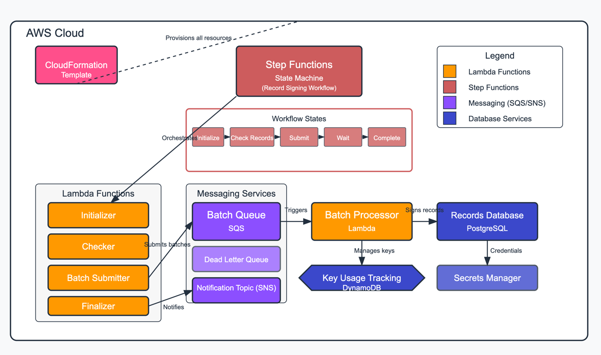

# Record Signing Service

A serverless, message-driven microservice solution for signing large volumes of records with a pool of cryptographic keys.

## Overview

This solution provides a scalable and efficient way to sign a large number of records (e.g., 100,000) using a collection of private keys (e.g., 100 keys) while ensuring:

- No double signing of records
- Safe key management (no concurrent use of the same key)
- Batch processing with configurable batch sizes
- Efficient key rotation using a least-recently-used strategy

The architecture uses AWS serverless services (Lambda, Step Functions, SQS, CloudFormation, DynamoDB) to create a highly scalable and resilient signing infrastructure.

## Architecture




### Components

1. **CloudFormation Stack**: Infrastructure as code defining all AWS resources
2. **Step Functions State Machine**: Orchestrates the workflow with the following states:
   - Initialize → Check Remaining Records → Submit Batches → Wait → Check Remaining Records → Complete
3. **SQS Queue**: Distributes batches for processing with visibility timeout and dead-letter queue
4. **Lambda Functions**:
   - **Initializer**: Sets up the database and key store, counts remaining unsigned records
   - **Batch Submitter**: Creates batches and submits them to SQS
   - **Batch Processor**: Signs records in a batch using a single key
   - **Checker**: Counts remaining unsigned records
   - **Finalizer**: Generates completion notification and reports
5. **DynamoDB**: Tracks key usage to implement least-recently-used strategy
6. **SNS Topic**: Sends notifications when the signing process completes
7. **PostgreSQL Database**: Stores records and signatures (accessed via AWS Secrets Manager)

## Key Features

- **Concurrent Processing**: Processes multiple batches simultaneously while ensuring no key is used concurrently
- **Least Recently Used Key Selection**: Distributes key usage evenly
- **Error Handling**: Includes retries, dead-letter queues, and error reporting
- **Monitoring**: Comprehensive logging and status tracking
- **Notification**: Email notifications on completion via SNS
- **Security**: Secure database credentials via AWS Secrets Manager

## Requirements

- AWS CLI configured with appropriate permissions
- Python 3.9.6
- AWS account with access to:
  - Lambda
  - Step Functions
  - SQS
  - SNS
  - DynamoDB
  - CloudFormation
  - Secrets Manager
  - KMS (for key operations)
- PostgreSQL database (credentials stored in Secrets Manager)

## Configuration

Create a `.env` file in the project root with the following variables:

```
# AWS Configuration
AWS_REGION=us-east-1
AWS_ACCOUNT_ID=123456789012
S3_BUCKET_SUFFIX=record-signing-deployment

# Stack Configuration
STACK_NAME=record-signing-service
ENVIRONMENT=dev

# Processing Configuration
BATCH_SIZE=1000
CONCURRENCY=10

# DB Creds AWS Secret
DB_SECRET_NAME=
```

## Deployment

### Initial Deployment

To deploy the solution for the first time:

```bash
./deploy.sh
```

This script will:
1. Load environment variables from `.env`
2. Validate AWS CLI installation and credentials
3. Create an S3 bucket for deployment artifacts
4. Package Lambda functions and dependencies
5. Upload the deployment package to S3
6. Deploy the CloudFormation stack
7. Output the ARN of the Step Function and SQS queue URL

### Cleanup

To delete all resources:

```bash
./cleanup.sh
```

This will:
1. Load environment variables from `.env`
2. Delete the CloudFormation stack
3. Empty and delete the S3 bucket
4. Clean up any remaining resources (Lambda functions, SQS queues)
5. Remove local deployment files

## Usage

After deployment, you can start the record signing process using the AWS CLI or AWS Console:

```bash
aws stepfunctions start-execution \
  --state-machine-arn <STATE_MACHINE_ARN> \
  --input '{"batch_size": 1000, "concurrency": 10}' \
  --region <AWS_REGION>
```

You can monitor the progress through the AWS Step Functions console.

## Implementation Details

### Database Schema

The solution uses a PostgreSQL database with the following schema:

```sql
CREATE TABLE IF NOT EXISTS records (
    id SERIAL PRIMARY KEY,
    data TEXT NOT NULL,
    signature TEXT,
    signed_at TIMESTAMP,
    signed_by TEXT
)
```

### Key Management

The `KeyManagementService` class (referenced in code) handles:
- Key acquisition to ensure no concurrent use
- Least-recently-used selection strategy
- Key release after batch signing
- Signing operations

DynamoDB is used to track key usage timestamps to implement the LRU strategy.

### Batch Processing Flow

1. **Initialization**: The Step Function starts with the Initializer Lambda
2. **Batch Submission**: The Batch Submitter sends batches to the SQS queue
3. **Processing**: The Batch Processor Lambda signs records using acquired keys
4. **Status Checking**: The Checker Lambda counts remaining unsigned records
5. **Completion**: The Finalizer Lambda notifies of process completion

## CloudFormation Resources

The CloudFormation template (`cloudformattion.yaml`) provisions:

1. **DynamoDB Table**: Tracks key usage
2. **SNS Topic & Subscription**: For completion notifications
3. **SQS Queue & Dead Letter Queue**: For batch processing
4. **Lambda Functions**: All required processing functions
5. **IAM Roles & Policies**: Necessary permissions
6. **Step Functions State Machine**: Workflow orchestration
7. **Event Source Mapping**: Connects SQS to Lambda

## Troubleshooting

- **CloudWatch Logs**: Each Lambda function has its own log group
- **Dead Letter Queue**: Check for failed batch processing messages
- **Step Functions Execution History**: Visual workflow showing the execution path
- **SNS Notifications**: Check for completion emails

## Security Considerations

- Database credentials stored in AWS Secrets Manager
- IAM roles following least privilege principle
- Lambda functions running in secure VPC (if configured)
- Key management ensuring no key overuse

## Development and Customization

To modify the solution:

1. Update the Lambda function code in the corresponding Python files
2. Modify the CloudFormation template as needed
3. Re-run `./deploy.sh` to deploy changes

### Adding Custom Processing Logic

To add custom processing logic, modify the `batch_processor.py` file to implement your specific signing algorithm or add additional validation steps.

### Scaling Considerations

- Adjust `BATCH_SIZE` and `CONCURRENCY` based on workload
- Increase Lambda memory allocation for faster processing
- Add VPC configuration for database access if needed
